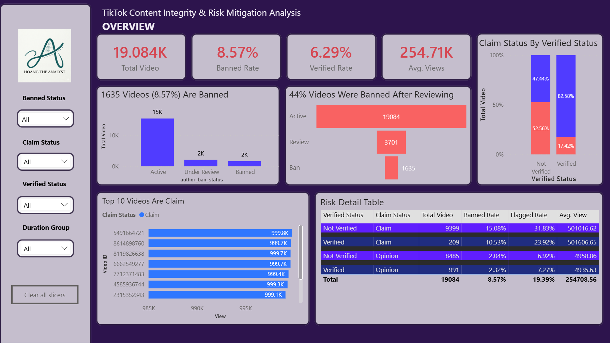

# TikTok Content Integrity & Risk Mitigation Analysis

## Tech Stack
PowerBI

## Overview
This project analyzes the relationship between claim-based content and banned videos on TikTok to identify high-risk video characteristics and support more effective content moderation strategies.

---

### 📊 Dashboard Preview


### 🔗 Interactive Dashboard
[View on Power BI Service](https://app.powerbi.com/links/UNnXTBr-2U?ctid=7212a37c-41a9-4402-9f69-ac32c6f76e1a&pbi_source=linkShare&bookmarkGuid=1989717d-d7f0-48b3-bcb9-7bec11f7c636)

---

## 📋 Business Problem & Objectives

### Problem
TikTok is currently facing increasing issues with claim-based videos spreading across the platform, negatively affecting overall content quality and platform trust.

### Objective
Analyze the relationship between claim-based content and banned videos to identify high-risk video characteristics and support more effective content moderation strategies.

---

## 🎯 Business Questions

- Are claim-based videos more likely to be banned than opinion-based videos?
- What characteristics are commonly associated with banned videos?
- Is TikTok's current moderation timing effective enough to prevent harmful content from spreading?

---

## 📊 Dataset & Assumptions

### Dataset Information
- **Source:** [Kaggle - TikTok Dataset](https://www.kaggle.com/code/abdallahgwaed/tiktok-dataset/input)
- **Type:** Simulated snapshot of TikTok video statuses captured at a specific point in time
- **Video Categories:** Claim-based or Opinion-based content

### Data Assumptions
- Each video belongs to one of two categories: Claim or Opinion
- All banned videos were previously active before being moved into the "Under Review" stage and being banned
- Videos marked as "Under Review" were also previously active videos
- Data quality has been validated to remove invalid categories and negative values

---

## 🔧 Key Steps Taken
- Data Cleaning: Removed invalid video categories and validated data quality issues such as negative values using Power Query.
- KPI Development: Built key DAX measures including Total Videos, Claim Rate, Banned Rate, Verified Rate, and Average Views.
- Data Visualization & Reporting: Designed two analytical dashboards focused on overall video & characteristics of banned videos

---

## 💡 Key Insights
- The top-performing videos were mostly claim-based content, with the highest-viewed video reaching nearly 1 million views. These videos appeared more frequently on non-verified accounts.
- Claim videos were 7.34 times more likely to be banned than opinion videos, despite both categories having relatively similar distribution levels. In addition, banned videos frequently contained the keyword "claim", suggesting a strong correlation between claim-oriented content and moderation risk.
- Banned videos showed several common characteristics:
  - Average views were over 200,000 higher than normal videos
  - Most were concentrated within the 25–35 second duration range
  - The majority originated from non-verified accounts

---

## 📈 Implications
- If not addressed, claim-based viral content from non-verified accounts will continue to dominate engagement while also driving higher moderation risk
- This creates a trade-off where TikTok's growth in views comes with increasing trust and safety pressure, potentially forcing stricter enforcement that could suppress organic reach and creator activity over time

---

## 🚀 Recommendations
- Strengthen early moderation for medium-length videos, especially when videos reach approximately 30K–50K views, focusing on videos containing the keyword "claim" or similar content patterns.
- Increase visibility and distribution support for opinion-based content to reduce creator incentives to mass-produce low-quality claim videos purely for engagement and views.

---

## 📝 Project Structure

```
Project 2 - TikTok Content Integrity & Risk Mitigation Analysis
├── README.md
├── Dashboard/
│   └── [Visualizations and findings]
├── Dataset/
│   └── tiktok_dataset.csv
├── Images/
│   └── [Dashboard previews and analysis charts]
└── README in DOCX/
```

---

**Last Updated:** May 2026
